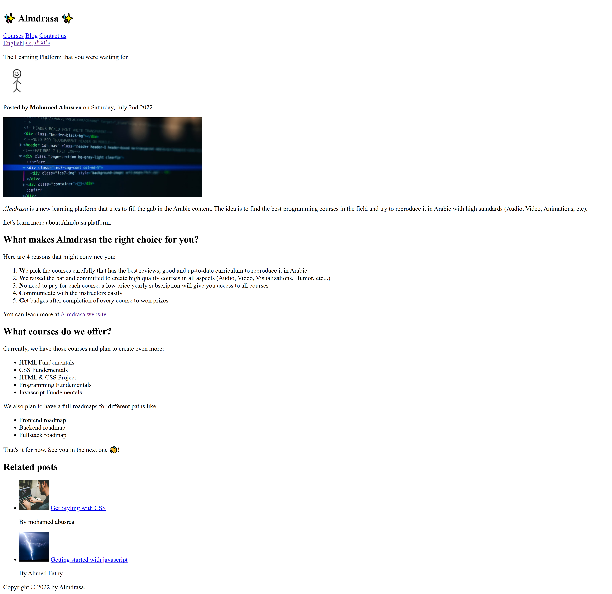
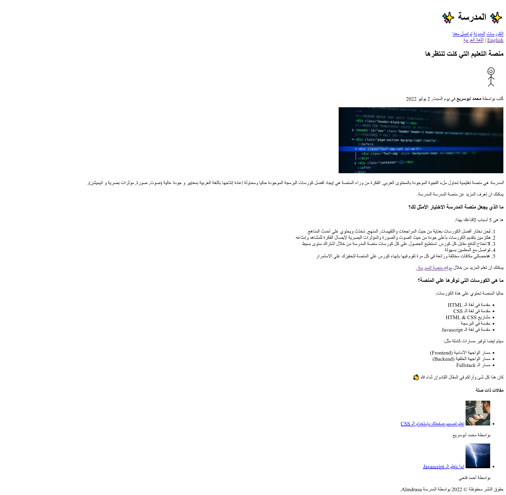

# 🌐 Challenge #1 – Multi-page Website (HTML Project)

This is the **first project** I built in the  
🎓 **[HTML Fundamentals](https://almdrasa.com/tracks/frontend-mern/courses/html-fundamentals/)** course offered by [Almdrasa](https://almdrasa.com).

It’s a **multi-page static website** that demonstrates the use of core **HTML concepts** such as semantic tags, navigation, lists, images, and bilingual support (English & Arabic).

---

## 🧠 Project Overview

The website includes:  
* `index.html` → Homepage (English version)  
* `index-ar.html` → Homepage (Arabic version)  
* `courses.html` → Courses page  
* `blog.html` → Blog page  
* `contact-us.html` → Contact page  
* `img/` → Images used across the site  

---

## 🚀 Features

* ✅ **Bilingual Support** – English & Arabic versions of the homepage  
* ✅ **Navigation Bar** – Links to Courses, Blog, and Contact pages  
* ✅ **Semantic HTML5 Structure** – Using `header`, `article`, `aside`, `footer`  
* ✅ **Content Formatting** – Ordered lists, unordered lists, strong/emphasis tags  
* ✅ **Related Posts Section** – With images, titles, and authors  
* ✅ **External Links** – Link to [Almdrasa website](https://almdrasa.com)  

---

## 🎯 What I Learned

* How to structure multi-page websites using **relative links**  
* Writing semantic and accessible HTML5  
* Adding **meta tags** for SEO & language direction (`dir="auto"`)  
* Building **bilingual websites** (English + Arabic)  
* Organizing website content into sections (`header`, `article`, `aside`, `footer`)  

---

## 🧰 Tech Stack

* `HTML5`

---

## 📸 Preview

### 🔹 English Homepage

### 🔹 Arabic Homepage

---

## ✅ Run the Project

Just open `index.html` (for English) or `index-ar.html` (for Arabic) in your browser.  
You can navigate between pages using the menu links.

---

👨‍💻 Created by [**Nabil**](https://www.linkedin.com/in/nabil-el-amrawy/) as part of the HTML Fundamentals course practice.
