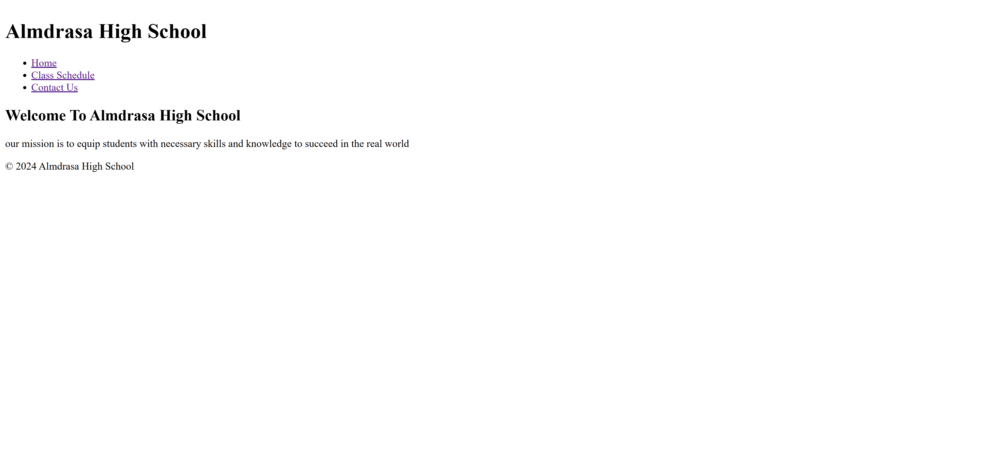
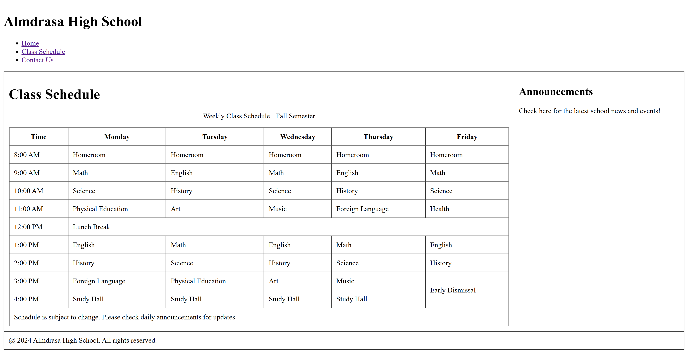
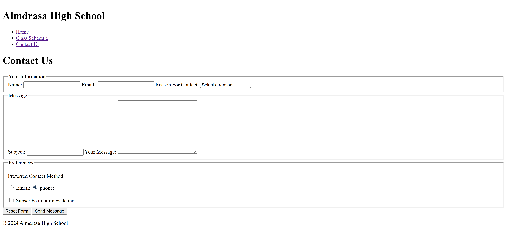

# 🏫 Challenge #3 – Almdrasa High School Website

This project is part of my practice in the course:  
🎓 **[HTML Fundamentals](https://almdrasa.com/tracks/frontend-mern/courses/html-fundamentals/)** offered by [Almdrasa](https://almdrasa.com)

---

## 🧠 Project Overview

In this challenge, I built a **multi-page school website** for **Almdrasa High School**.  
The website includes navigation, class schedule, announcements, and a contact form with different input fields and validation.

---

## 📂 Files in the Folder

| File / Folder         | Description                                |
| --------------------- | ------------------------------------------ |
| `index.html`          | Homepage with welcome message and mission  |
| `contact-us.html`     | Contact form page with multiple inputs     |
| `schedule.html`       | Weekly class schedule + announcements      |
| `preview/`            | Folder containing website screenshots      |

---

## 🚀 Features

* 🏠 **Homepage** – Includes school name, mission, and navigation menu  
* 📅 **Schedule Page** – Weekly class schedule table with announcements sidebar  
* 📩 **Contact Page** – Form with text fields, select dropdown, radio buttons, and checkboxes  
* ✅ Form includes **required validation** for important fields  
* 📸 Preview screenshots available in the `preview/` folder  

---

## 📸 Project Preview

### Homepage  

### Class Schedule  

### Contact Us Page  

---

👨‍💻 Created by [**Nabil El Amrawy**](https://www.linkedin.com/in/nabil-el-amrawy/) as part of the HTML Fundamentals course practice.
