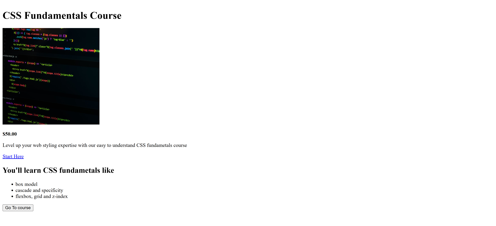
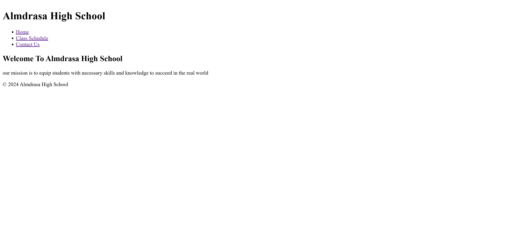

# 📘 HTML Challenges (Course Projects)

This is my **practice folder** required to complete the course:

🎓 **[HTML Fundamentals](https://almdrasa.com/tracks/frontend-mern/courses/html-fundamentals/)** offered by [Almdrasa](https://almdrasa.com)

By completing these challenges, I practiced the **core HTML concepts** while building real mini-projects.  
This course is a solid foundation for anyone starting in **Frontend Development**.

---

## 🧠 Project Overview

The folder contains **3 challenge projects**:  

* **CHALLENGE #1** → Multi-page static website (English + Arabic version)  
* **CHALLENGE #2** → Single-page project showcasing **CSS Fundamentals** concepts  
* **CHALLENGE #3** → Multi-page **School Website** (Homepage, Class Schedule, Contact Form)  

Each project applies the concepts learned in the course and helps in understanding how to structure semantic HTML pages.

---

## 📂 Files in the Repository

| Folder         | Description |
| -------------- | ----------- |
| `CHALLENGE#1` | Includes `index.html`, `index-ar.html`, `courses.html`, `blog.html`, `contact-us.html`, and `img/` folder for images |
| `CHALLENGE#2` | Includes `index.html` and `images/` folder (CSS Fundamentals course project) |
| `CHALLENGE#3` | Includes `index.html`, `schedule.html`, `contact-us.html`, and `preview/` folder for screenshots |

---

## 🚀 Features in Challenge #1

* ✅ Multi-page navigation (Home, Blog, Courses, Contact)  
* ✅ **Bilingual support** → English and Arabic homepages  
* ✅ Semantic HTML structure (`header`, `nav`, `article`, `aside`, `footer`)  
* ✅ Ordered & unordered lists for courses and features  
* ✅ Linked images and external resources  
* ✅ Clear separation of content and structure  

---

## 🚀 Features in Challenge #2

* ✅ CSS Fundamentals demo page  
* ✅ Product-like card with **image, title, price, and description**  
* ✅ Styled **button** and call-to-action link  
* ✅ Semantic list of CSS topics (Box model, Cascade, Flexbox, Grid, etc.)  

---

## 🚀 Features in Challenge #3

* ✅ **Multi-page school website** (Homepage, Class Schedule, Contact Us)  
* ✅ Navigation menu linking all pages together  
* ✅ Class Schedule with a **semantic table** (thead, tbody, tfoot)  
* ✅ Contact form with text inputs, dropdown, radio buttons, and checkboxes  
* ✅ Preview screenshots available in the `preview/` folder  

---

## 🎯 What I Learned

* Building multi-page websites with internal navigation  
* Using semantic HTML5 tags correctly  
* Adding **meta tags** for better SEO and accessibility  
* Linking external and internal resources  
* Writing content in both **English and Arabic** versions  
* Structuring forms with different input types (text, email, select, radio, checkbox)  
* Creating tables with headers, rows, and footers  

---

## 🧰 Tech Stack

* `HTML5`

---

## 📸 Project Previews

### 🔹 Challenge #1 – Multi-page Website
Homepage (English version):  

Homepage (Arabic version):  

---

### 🔹 Challenge #2 – CSS Fundamentals
Homepage :  

---

### 🔹 Challenge #3 – Almdrasa High School Website
Homepage :  

---

## ✅ Run the Project

Just open any `.html` file in your browser (e.g., `index.html`) and navigate between pages.  

---

👨‍💻 Created by [**Nabil El Amrawy**](https://www.linkedin.com/in/nabil-el-amrawy/) during the HTML course practice.
